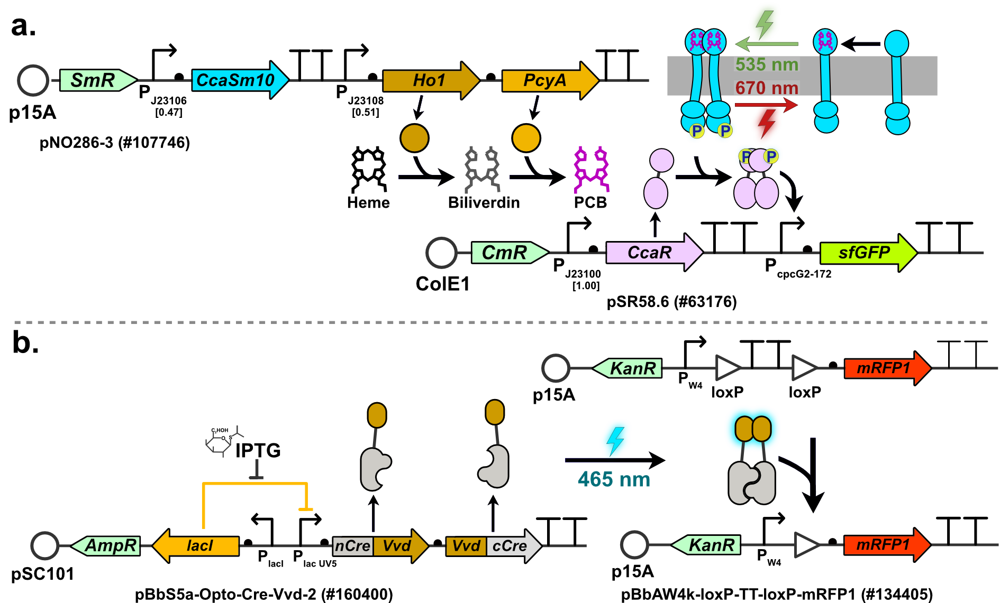
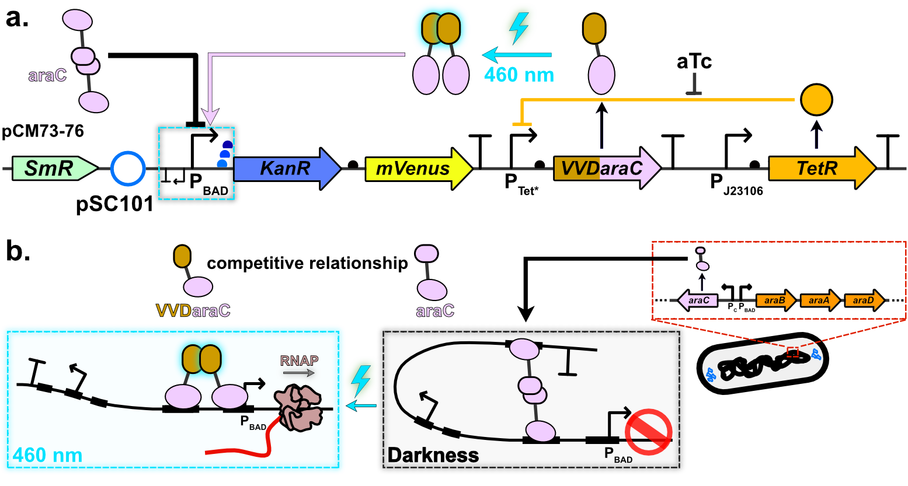

# Chapter 4 - OptoSelect: An Optogenetic Selection Platform in Microfluidic Devices

This chapter contains the plasmid maps of the three optogenetic expression system I investigated during my PhD: 

1. **CcaSR** 
    1. ACS Synth. Biol. 2014, 3, 11, 820–831,September 24, 2014 https://doi.org/10.1021/sb500273n 
    2. Chait, R., Ruess, J., Bergmiller, T. et al. Shaping bacterial population behavior through computer-interfaced control of individual cells. Nat Commun 8, 1535 (2017). https://doi.org/10.1038/s41467-017-01683-1
    3. Nicholas T. Ong and Jeffrey J. Tabor. A miniaturized escherichia coli green light
sensor with high dynamic range. ChemBioChem, 19:1255–1258, 2018. doi:10.
1002/cbic.201800007.
3. **OptoCreVVD**
    1. ACS Synth. Biol. 2020, 9, 2, 227–235, January 21, 2020, https://doi.org/10.1021/acssynbio.9b00395
    2. Sheets, M.B., Tague, N. & Dunlop, M.J. An optogenetic toolkit for light-inducible antibiotic resistance. Nat Commun 14, 1034 (2023). https://doi.org/10.1038/s41467-023-36670-2
4. **BLADE** 
    1. Romano, E., Baumschlager, A., Akmeriç, E.B. et al. Engineering AraC to make it responsive to light instead of arabinose. Nat Chem Biol 17, 817–827 (2021). https://doi.org/10.1038/s41589-021-00787-6  
